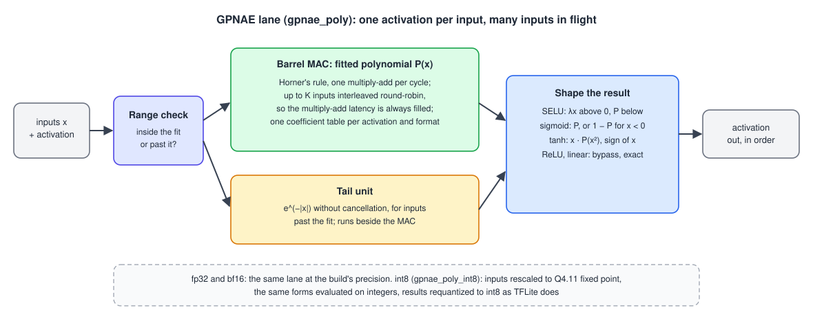

# GPNAE

**A hardware activation engine for neural networks: SELU, sigmoid, tanh, ReLU and linear, in fp32, bf16 and int8.**

Neural-network accelerators are good at multiply-accumulate and slow at non-linear functions. GPNAE evaluates activation functions on the same kind of multiply-accumulate hardware, using polynomials. It began as TYTAN, published at VDAT 2025, and is now the activation stage of the [SIENNA](https://github.com/SoHam-56/SIENNA) accelerator.

| | |
|---|---|
| **35× fewer cycles** per activation | than the published design: 747 → 20–22 cycles for tanh (fp32) |
| **21 ns** per tanh in fp32 | 15 ns in int8, on one lane at 950 MHz |
| **within 0.39%** of the exact functions | in fp32, over 7 200 checked inputs |
| **bit-exact** | bf16 and int8 lanes match a Python model of the hardware on every output |
| **35.8× smaller, 1.77× lower power** | than NVDLA's activation processor in the same 45 nm process (published TYTAN core) |

---

## The published design: TYTAN

> S. Pramanik, V. William, A. Raha, D. Das, A. Mukherjee and J. L. Paluh, "TYTAN: Taylor-series based Non-Linear Activation Engine for Deep Learning Accelerators," VDAT 2025, Springer. [Book](https://link.springer.com/book/9783032263049) · [arXiv:2512.23062](https://arxiv.org/abs/2512.23062)

**Code as published:** tag [`tytan_vdat2025`](https://github.com/SoHam-56/GPNAE/tree/tytan_vdat2025).

TYTAN computes e^x as a Taylor series on a modified multiply-accumulate unit (Horner's rule), then reshapes it:
- **SELU:** λα(e^x − 1);
- **sigmoid:** e^x / (e^x + 1);
- **tanh:** (e^2x − 1) / (e^2x + 1).

A software search picks how many Taylor terms each activation layer needs to stay within an accuracy budget, so accuracy and cost trade off per layer. The paper maps Swish, GELU and Softplus onto the same engine. The published RTL implements SELU, sigmoid and tanh in fp32.

Synthesized with Synopsys Design Compiler in FreePDK45, as published:

| Design | Process | Area (mm²) | Power (mW) | Max clock (MHz) |
|---|---|---|---|---|
| **TYTAN** | FreePDK45 | 0.028 (core), 0.037 (with SELU, sigmoid, tanh) | 19.86 (core), 24.37 (with them) | **950** |
| NVIDIA NVDLA | FreePDK45 | 1.002 | 35.165 | 450 |
| NN-LUT | 7 nm | 0.001 | 0.059 | not reported |
| UNO | TSMC 45 nm | 0.283 (kernel) | 66.5 (64 PEs) | 400 |
| ViTALiTy | 28 nm CMOS | 5.22 | 1 460 | 500 |

Source: Table 3 of the paper. Against NVDLA's single-data-point processor in the same process, the TYTAN core is 35.8× smaller, uses 1.77× less power and runs at 2.11× the clock (27.1× smaller and 1.44× less power with the SELU, sigmoid and tanh add-ons). The paper measured 747 cycles per tanh output with 30 Taylor terms.

---

## What changed since

The published engine computed one input at a time. Today's lane is built for throughput:



1. **A short polynomial per function.** The published design built every function from e^x, which needed up to 30 series terms and, for sigmoid and tanh, a division. Today each function has its own short polynomial, fitted to that function alone, so only multiplies and adds are left. Inputs too large for the fit go to a small side unit that handles the flat tails of the curve.
2. **Many inputs share one multiply-add unit.** A polynomial is evaluated as a chain in which each step waits for the previous one, so the published design kept its multiplier busy only about 6% of the time. The new unit works on many inputs in turn, like a barrel processor, so it starts a new operation every cycle.
3. **Three number formats.** bf16 runs the same lane at lower precision. A fixed-point int8 lane takes quantized inputs and returns quantized outputs, as TensorFlow Lite does.
4. **Verification.** Bit-exact Python models of every lane, a regression with ten stimulus patterns per activation, and correctness fixes in the control logic. The published Taylor lane is still in the repository (`src/gpnae.sv`) and is checked by the same regression.

---

## Performance

> Measured in cycle-accurate Verilator simulation of the fitted-polynomial lane. Times assume a **950 MHz** clock, the frequency the published design reached. Synthesis of today's lane is planned.

**Cycles per input on one lane,** as the testbench reports them for each stimulus pattern:

| Format | SELU | sigmoid | tanh | ReLU, linear |
|---|---|---|---|---|
| fp32 | 18–20 cycles · 19–21 ns | 16–39 cycles · 17–41 ns | 20–22 cycles · 21–23 ns | bypass |
| bf16 | 18 cycles · 19 ns | 16–28 cycles · 17–29 ns | 19 cycles · 20 ns | bypass |
| int8 | 13 cycles · 14 ns | 14 cycles · 15 ns | 14 cycles · 15 ns | 6 cycles · 6 ns |

The upper end of each range comes from inputs at the edges of the fitted range, which take the tail unit.

**Accuracy against the exact functions** (worst case over ten stimulus patterns):

| Format | SELU | sigmoid | tanh |
|---|---|---|---|
| fp32 | 0.006% | 0.061% | 0.39% |
| bf16 | 2.8% | 7.2% | 8.6% |
| int8 | 9 LSB | 7 LSB | 3 LSB |

In fp32 every output is within the regression's 1% bound. bf16 carries only 8 significant bits, and with that precision sigmoid and tanh exceed the 6.25% bound at their worst points. The bf16 and int8 lanes match their bit-exact models on every output.

### Compared with other activation hardware

| Design | Method | Precision | Cycles per output |
|---|---|---|---|
| **GPNAE today** | fitted polynomial on a barrel multiply-accumulate unit | fp32 · bf16 · int8 | 16–22 · 16–28 · 13–14 (one lane) |
| **TYTAN, as published** | Taylor series of e^x, then reshaped | fp32 | 747 (tanh, 30 terms) |
| NN-LUT [1] | 16-entry lookup table, piecewise linear | INT32, FP16, FP32 | 2 |
| UNO [2] | degree 2–4 Taylor series on existing MAC units | 8-bit fixed point | 3–5 per primitive (exp, log, divide) |
| CORDIC-based [3] | CORDIC rotations and division | 8-bit | 9 |

Lookup tables and short series take fewer cycles at reduced precision or with fewer segments. GPNAE keeps fp32 results within 0.39% of the exact functions, and it supports bf16 and int8 in the same lane design.

[1] NN-LUT, DAC 2022, [arXiv:2112.02191](https://arxiv.org/abs/2112.02191) · [2] UNO, ISLPED 2021, [paper](https://jsm.ece.wisc.edu/docs/wu-islped2021.pdf) · [3] Kokane et al., "CORDIC Is All You Need", 2025, [arXiv:2503.11685](https://arxiv.org/abs/2503.11685)

---

## Getting started

You need Verilator 5 with a C++20 compiler (its `--timing` mode needs coroutines), and Python ≥ 3.10 with NumPy.

```bash
git clone --recursive https://github.com/SoHam-56/GPNAE.git
cd GPNAE

python3 regression.py                                    # the published Taylor lane, fp32
python3 regression.py --lane poly --format bf16          # today's lane, against the exact functions
python3 regression.py --lane poly --format bf16 --model hw   # bit for bit against the hardware model
python3 regression.py --lane poly --format int8          # the int8 lane
```

`regression.py` generates the stimulus, builds the testbench and checks every output. `gpnae_model.py` is the bit-exact model of the hardware, and `fit_poly_coeffs.py` fits the coefficient tables. Results go to `testbenches/results/`.

---

## Author

Soham Pramanik · [LinkedIn](https://www.linkedin.com/in/soham-pramanik-224004271/)
